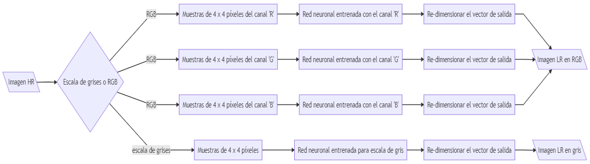
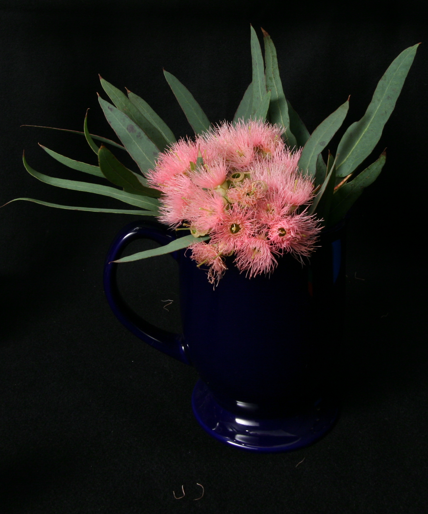
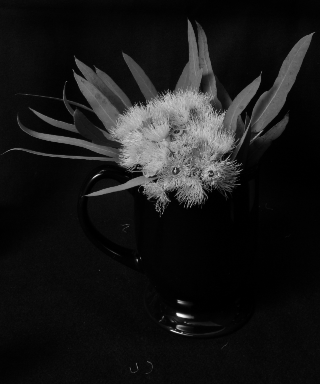

# Red Neuronal Sub-Muestreadora de Imágenes
Este repositorio contiene el código fuente y los materiales para el proyecto de la Red Neuronal Sub-Muestreadora de Imágenes, desarrollado en la asignatura de enfásis "Inteligencia Artificial" en el programa de Ingeniería Electrónica de la Pontificia Universidad Javeriana. ***Autores: Juan Felipe Jaramillo Hernández, María Fernanda Hernández Baena, Jose David Cifuentes Semanate.***

Este repositorio contiene los códigos para entrenar y validar la red neuronal, además de los códigos para la generación del conjunto de datos a partir de los recursos disponibles en [Common Objects in Context](https://cocodataset.org/#termsofuse) (*Imágenes pertenecientes a [Flickr](https://www.flickr.com/creativecommons/) con licencia [Creative Commons](https://creativecommons.org/licenses/by/4.0/legalcode)*). También se encuentra un modelo pre-entrenado para cada canal de color o para escala de grises. El video y el artículo se pueden encontrar acá:

aca [a relative link](other_file.md) hay esto

Video: <>
Artículo: <>

### Resultados Obtenidos
Nuestra red neuronal es capaz de sub-muestrear una imagen de entrada en un factor K = 4, penalizando las frecuencias altas con el fin de evitar efectos de aliasing en la imagen re-muestreada. 

La arquitectura de alto nivel del sistema se representa a continuación; el usuario debe elegir si la imagen se sub-muestreara en los tres canales de color o en un solo canal representado como escala de grises.

**Imagen de entrada HR**

**Imagen de salida LR en RGB o escala de grises**

**Imagen de entrada HR**

**Imagen de salida LR en RGB o escala de grises**

## Ejecutar el modelo pre-entrenado

## Generación del conjunto de datos

## Entrenar el modelo
