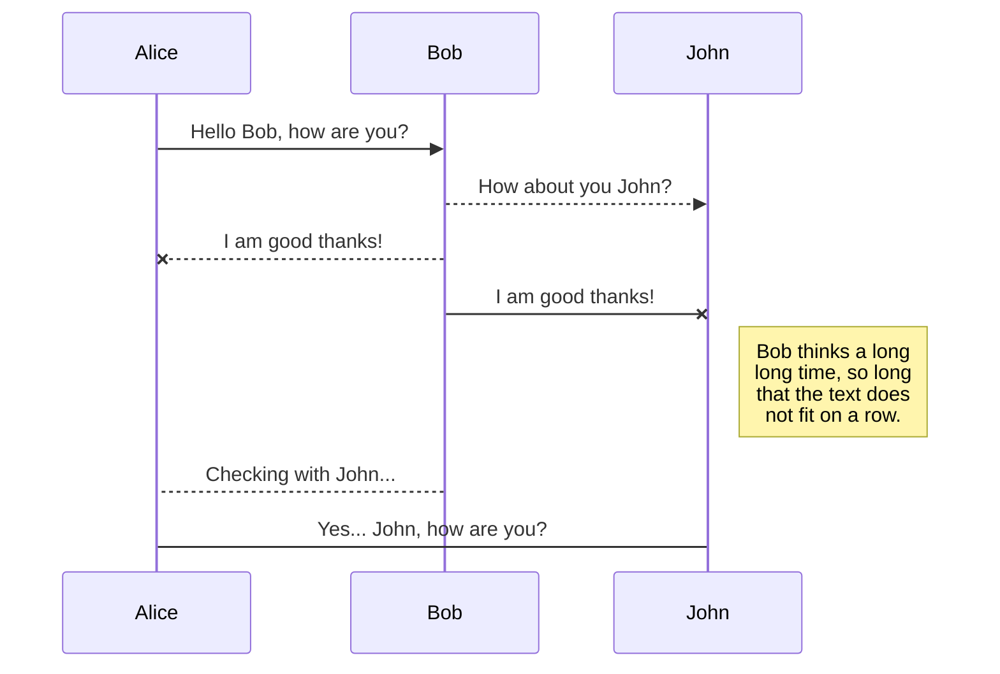
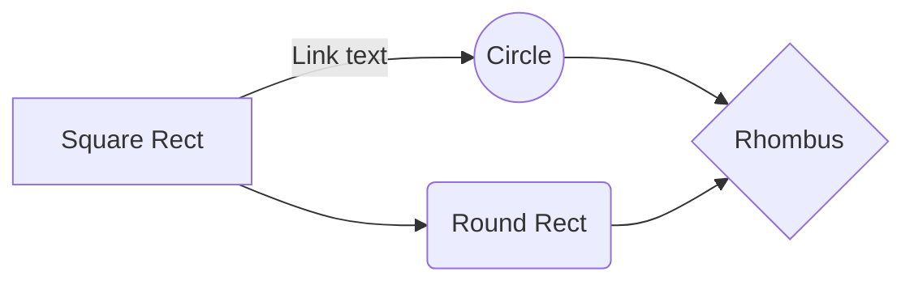

# Red-Neuronal-Sub-Muestreadora-de-Imagenes
Este repositorio contiene el código fuente y los materiales para el proyecto de la Red Neuronal Sub-Muestreadora de Imágenes, desarrollado en la asignatura de enfásis "Inteligencia Artificial" en el programa de Ingeniería Electrónica de la Pontificia Universidad Javeriana. ***Autores: Juan Felipe Jaramillo Hernández, María Fernanda Hernández Baena, Jose David Cifuentes Semanate.***

Este repositorio contiene los códigos para entrenar y validar la red neuronal, además de los códigos para la generación del conjunto de datos a partir de los recursos disponibles en [Common Objects in Context](https://cocodataset.org/#termsofuse) (*Imágenes pertenecientes a [Flickr](https://www.flickr.com/creativecommons/) con licencia [Creative Commons](https://creativecommons.org/licenses/by/4.0/legalcode)*). También se encuentra un modelo pre-entrenado para cada canal de color o para escala de grises. El video y el artículo se pueden encontrar acá:

Video: <>
Preprint: <>

### Resultados Obtenidos
Nuestra red neuronal es capaz de sub-muestrear una imagen penalizando las frecuencias altas con el fin de evitar efectos de aliasing en la imagen re-muestreada, más adelante se explicará en más detalle el proceso de aprendizaje de la red neuronal. La arquitectura de alto nivel del sistema se representa a continuación:

You can render UML diagrams using [Mermaid](https://mermaidjs.github.io/). For example, this will produce a sequence diagram:

And this will produce a flow chart:

